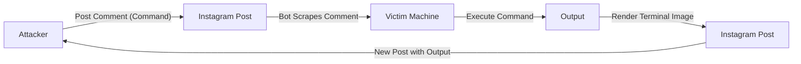

# instc2  

**instc2** is a proof-of-concept Instagram-based **Command & Control (C2)** system.  
It abuses Instagram posts and comments to create a covert channel where commands can be issued through comments, executed on the infected system, and their outputs are posted back to Instagram as terminal-style images.  

**Demos**:  
- [Demo 1](https://www.instagram.com/shikymagey2/p/DNiaq7zoCIY/)  
- [Demo 2](https://www.instagram.com/shikymagey2/p/DNiadQmIqEd/)  
- [Demo 3](https://www.instagram.com/shikymagey2/p/DNiaTkJoWDC/)
- **Demos video**:
  
https://github.com/user-attachments/assets/5de5f44c-6976-4293-b869-793171f25517


---

##  How It Works  




1. **Attacker posts command** as a comment on Instagram.  
2. **Bot scrapes comment** and executes it locally.  
3. **Command output** is captured and drawn into a fake terminal screenshot.  
4. **Bot uploads image** back to Instagram.  
5. The loop continues until `"stopme"` is commented.  

---

##  Features
- Stealthy **Instagram-based C2 channel**  
- Automated **login and cookie management**  
- Reliable **Instagram posting** with Playwright  
- Comment scraper + **real comment filtering**  
- Executes arbitrary shell commands  
- Terminal-style **image generator** for exfiltration  
- Continuous post/comment/execute loop  

---

##  Project Structure
```
.
├── instc2.py                 # Core C2 logic (post, scrape, exec, repost)
├── instc2_cookie_maker.py    # Login helper, saves session cookies
├── DejaVuSansMono-Bold.ttf   # the fount
├── requirements.txt          # the requirements
├── cookies.json              # the cookie file 
├── instc2_workflow.png       # Workflow diagram
```
---

##  Installation  

```bash
git clone https://github.com/YOUR_USERNAME/instc2.git
cd instc2

python3 -m venv venv
source venv/bin/activate

pip install playwright pillow
playwright install chromium
```

---

##  Usage  

1- **Generate cookies** (first login)  
```bash
python instc2_cookie_maker.py
```

2- **Start the C2 agent**  
```bash
python instc2.py
```

# Flow:  
- Posts terminal image  
- Waits for attacker’s command via comment  
- Executes on host  
- Posts result back to Instagram  


---

##  Disclaimer  
This project is for **educational and research purposes only**.  
Running this against accounts/systems you don’t own is **illegal**.  
Use in controlled environments (e.g. red team labs, malware research).  
